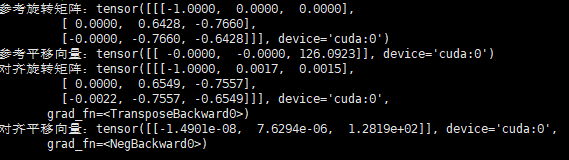
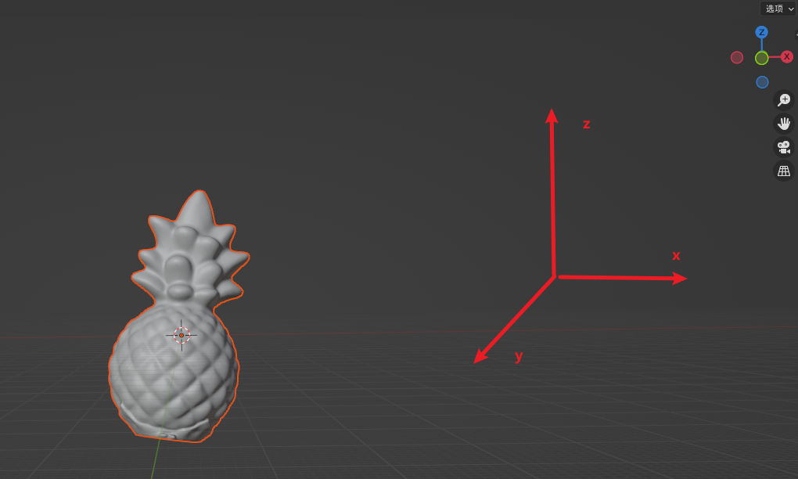

## 项目介绍

项目代码参考自[PyTorch3D · A library for deep learning with 3D data](https://pytorch3d.org/tutorials/camera_position_optimization_with_differentiable_rendering)。目的是使用一张参考Mask作为标签，模型通过对Mesh的图像进行可微分渲染得到一张渲染Mask，通过对两个Mask计算误差然后反向传播逐渐优化模型参数（即相机的旋转矩阵R和平移向量T）。我们在其基础上进行修改实现了使用多张Mask同时进行监督（代码中是两个Mask），只需要提前计算好两个相机之间的相对位置（即相对旋转矩阵R和相对平移向量T，代码中有这个函数的实现），然后在渲染过程中，对当前相机位置执行相对位置计算可以得到第二个相机的R和T（代码中也有函数实现）。渲染器只需要接收相机的R和T就可以渲染输出图像，因此我们输入两个不同的R和T可以得到两张Mask，分别与两个对应的标签进行计算Loss即可。

## 环境安装

Pytorch3d在Windos上配置相当麻烦不建议尝试。这个环境的难点主要就是需要高版本的pytorch(>2.0)以及与`nccv --version`匹配的CUDA

首先创建环境
```bash
conda create -n pytorch3d python=3.8 -y
```

然后安装torch(openbayes上不需要手动安装，速度很快)
```bash
conda install pytorch==2.0.1 torchvision==0.15.2 torchaudio==2.0.2 pytorch-cuda=11.7 -c pytorch -c nvidia
```

安装依赖包
```bash
conda install -c fvcore -c iopath -c conda-forge fvcore iopath
```

安装pytorch3d
```bash
conda install pytorch3d -c pytorch3d
```

## 项目运行

激活环境后，如果简单的运行示例代码，只需要保证data目录下有‘rooster_small.obj’文件，其他参数全部使用默认配置

```python
python camera_align.py
```

也可以手动指定参数执行

```python
python camera_align.py --loop_num 3000 --camera_location "(81,0,96)"
```

成功执行完毕后终端会输出参考R/T和对齐R/T的结果



同时在项目目录下会有优化过程的.gif文件以及起始位置和目标位置的对比.png文件生成

## 注意事项

- 项目示例中使用的是两张用pytorch3d的Phong渲染器生成的Mask图像作为标签，后续应该是需要使用自己输入的Mask，代码中留下了相应的实现，可以根据具体需求更改；
- 一定注意使用的.obj文件不能过大（pytorch3d无法处理大网格模型），面数最好设置为50000。一种方式是使用MeshLab对OBJ文件进行编辑（Filters->Remeshing, Simplification and Reconstruction->Simplification: Quadric Edge Collapse Decimation），设定面数之后等待编辑完成然后导出修改完的OBJ文件即可

- 另外因为渲染的Mask需要指定分辨率大小，pytorch3d很占用内存，基本上`612*512`大小的图像就是极限（我一直使用的是`306*256`）。所以参考Mask最好做降低分辨率的处理；
- 最后也是最重要的一点是对齐质量很依赖初始位置，这个项目只能作为精细调整。所以有必要事先确定一个较好的初始化位置，然后通过修改‘camera_location’参数执行初始化。凯龙在飞书上写了一个教程[‌‌⁠‬⁠‬‍‌‌⁠⁠‬‌⁠‍‌‬⁠‌‬‍‌Mesh与图片的对齐（含Blender插件安装） - 飞书云文档 (feishu.cn)](https://z1fow0wh5tr.feishu.cn/docx/AM7NdDzqeoJtDRxZt4mcPZuInZg)，但是他的输出并没有我们需要的R和T，而且过于麻烦。关于确定初始位置这个事情可能需要探索一下。


